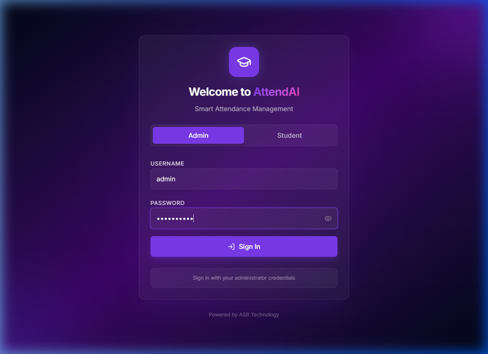
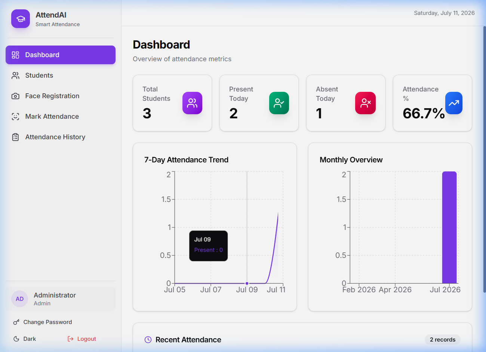
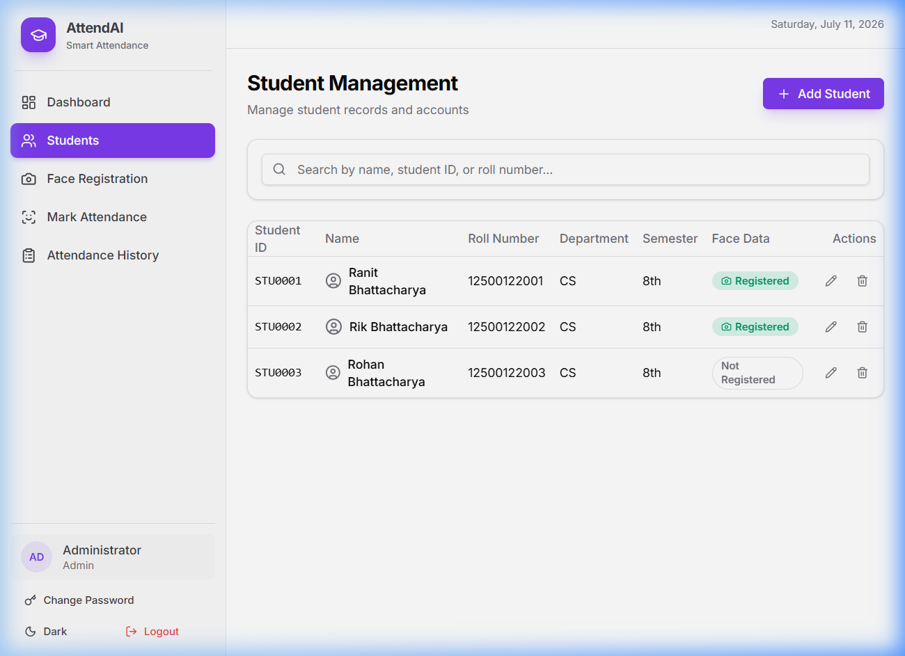
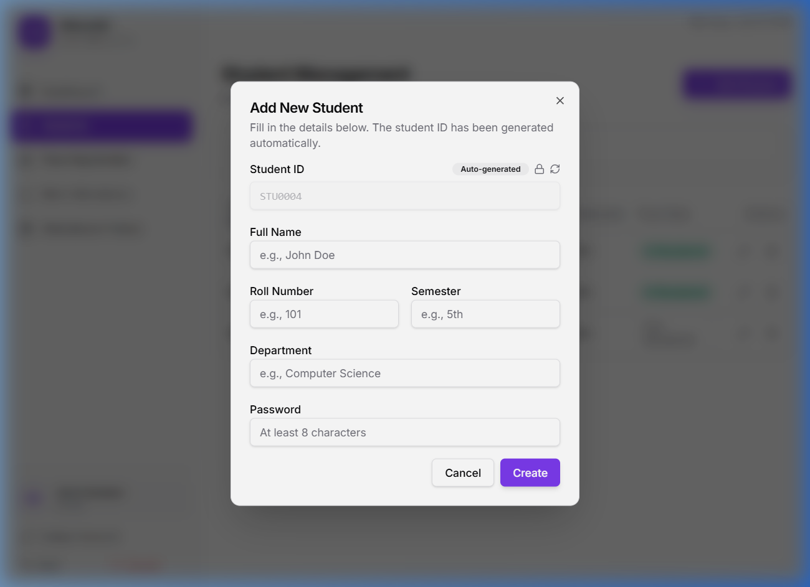
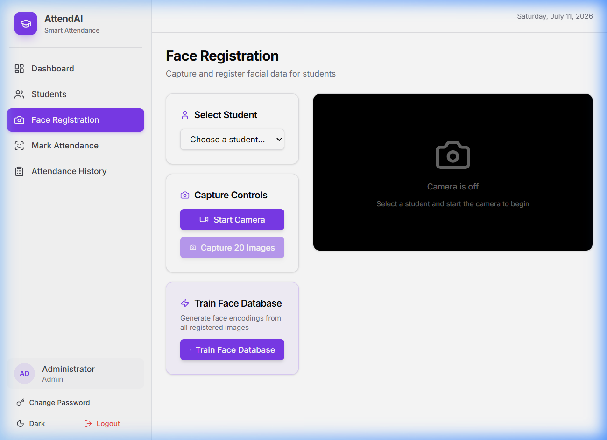
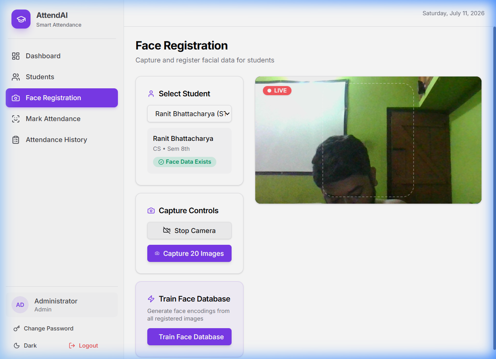
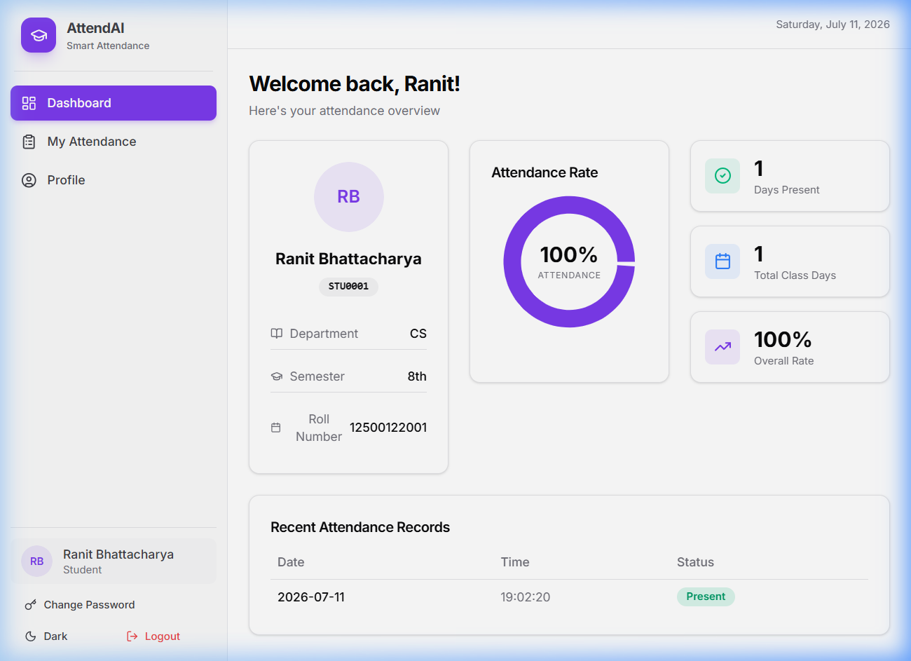
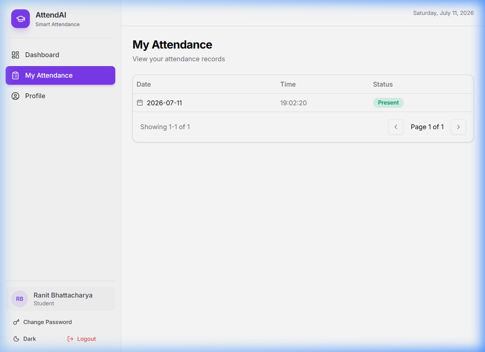
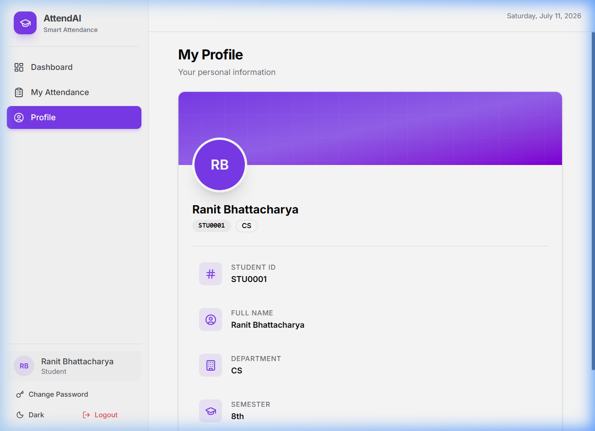

# AttendAI — Smart Face Recognition Attendance System



AttendAI is a modern, responsive, and robust smart attendance system built with a React frontend and a FastAPI backend. It replaces traditional manual tracking with state-of-the-art AI facial recognition.

## 🚀 Features

- **Automated Face Attendance**: Instantly marks attendance by analyzing camera feeds through face recognition.
- **Role-based Authentication**: Secure access separation between Admins (management & operations) and Students (viewing & tracking).
- **Admin Dashboard**: Advanced data visualizations, analytics charts, and real-time attendance statistics.
- **Smart Student Management**: Automated sequential ID generation (`STU0001`, `STU0002`) and intuitive user enrollment.
- **Student Portal**: Empower students to view their attendance history, daily presence status, and personal profiles in real-time.
- **Audio Feedback**: Success sounds play when attendance is successfully marked.
- **Responsive UI**: Glassmorphism aesthetic and smooth micro-animations tailored for modern devices.

## 🛠️ Technology Stack

- **Frontend**: React (Vite), TailwindCSS, Recharts (for analytics), Shadcn UI, Axios.
- **Backend**: FastAPI (Python), SQLite (via SQLAlchemy), Pydantic, PassLib (Bcrypt authentication), face_recognition (OpenCV).
- **Architecture**: RESTful API design.

---

## 📸 Working Mechanisms & Walkthrough

Here is a step-by-step visual guide on how the system operates:

### 1. Secure Login
Both Students and Admins use a unified, tabbed authentication portal.


### 2. Admin Dashboard & Analytics
Once an Admin logs in, they get a bird's-eye view of all attendance statistics via modern, interactive charts.


### 3. Student Management & Auto-ID
Admins can manage enrolled students. When adding a new student, the system automatically assigns the next available sequential ID (e.g., `STU0001`, `STU0002`).



### 4. Admin: Face Registration
After adding a student, the Admin registers their biometric face data directly from the system's camera interface.



### 5. Admin: Mark Attendance
To take attendance for a class, the Admin opens the Mark Attendance module. The camera scans incoming students and instantly logs their presence using the AI model, accompanied by a success chime.


### 6. Student Portal & History
When a student logs in, they access their personalized dashboard to view their profile, past attendance logs, and present/absent analytics.




---

## ⚙️ Step-by-Step Local Setup Instructions

### Prerequisites
- Python 3.10+
- Node.js v18+
- C++ Build Tools (required for compiling the `dlib` dependency of `face_recognition` on Windows)

### 1. Backend Setup (FastAPI)

1. Navigate to the backend directory:
   ```bash
   cd backend
   ```
2. Create and activate a virtual environment:
   ```bash
   python -m venv venv
   .\venv\Scripts\activate   # On Windows
   ```
3. Install the dependencies:
   ```bash
   pip install -r requirements.txt
   ```
4. Start the backend development server:
   ```bash
   python -m uvicorn app.main:app --reload --port 8000
   ```
*(The backend API will run at `http://localhost:8000`)*

### 2. Frontend Setup (React/Vite)

1. Open a new terminal and navigate to the frontend directory:
   ```bash
   cd frontend
   ```
2. Install the node modules:
   ```bash
   npm install
   ```
3. Start the Vite development server:
   ```bash
   npm run dev
   ```
*(The frontend application will be accessible at `http://localhost:5173`)*

### 3. Default Credentials
- **Admin**: Username: `admin` | Password: `Ranit@2003` (or the password configured during setup)
- **Student**: Username: `STU0001` | Password: `Ranit@2003`
